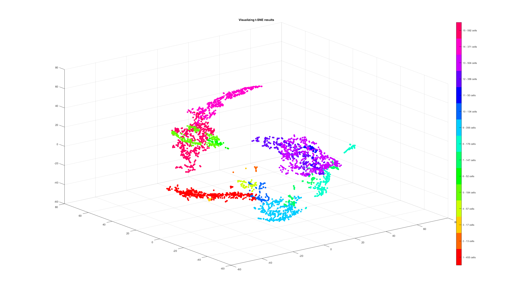

# RNA_seq Pipeline
This repository is for maintaining the codes for RNA_seq dataset.

# Pipeline:

### 1. Download the Dataset:
Download the __Census of Immune Cells__ dataset from https://preview.data.humancellatlas.org.

This will create 4 folders with `fastq.gz` files. Unzip the files in each folder:
```bash
tar -xzf *.fastq.gz
```

### 2. Prepare the Dataset:
1. Download the __cellranger__ sofware from [here](https://support.10xgenomics.com/single-cell-gene-expression/software/pipelines/latest/using/count).

2. Download the __GRCh38__ as the reference.

3. Run __cellranger count__ following the instructions from [here](https://support.10xgenomics.com/single-cell-gene-expression/software/pipelines/latest/using/count). For example for MantonBM1:
```bash
cellranger count --id=MantonBM1 \
--fastqs=2a87dc5c-0c3c-4d91-a348-5d784ab48b92 \
--transcriptome=<path_to_reference_file> \
--sample=MantonBM1_HiSeq_1,MantonBM1_HiSeq_2,MantonBM1_HiSeq_3,MantonBM1_HiSeq_4,MantonBM1_HiSeq_5,MantonBM1_HiSeq_6,MantonBM1_HiSeq_7
```

This will create a folder `MantonBM1`. locate the `filtered_gene_bc_matrices_h5.h5` file.

### 3. Run Non-Parametric Clustering:
You have following parameters to tune for different setting:
- cutoff_thresh  : Remove genes that the sum of counts is below threshold
- dim_red_method: Dimension reduction method { 'PCA' , 'SNE'}
- red_dim       : Reduced dimension

It will visualize samples in a color-coded manner like this:

